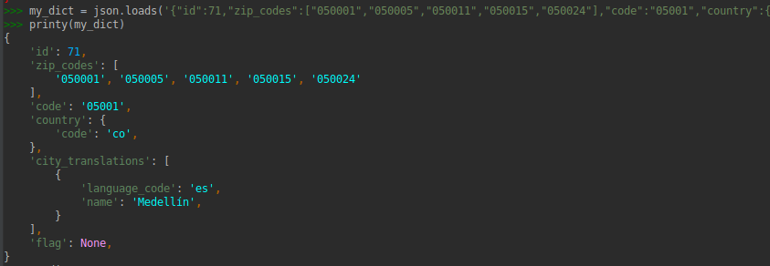
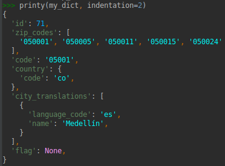
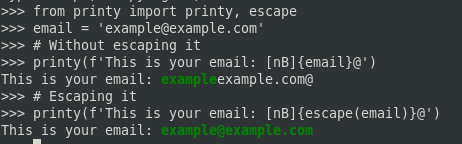
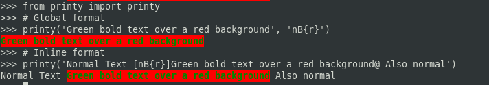

# Printy

<p align="center">
  
</p>

<p align="center">
  <em>Sometimes you just want to print stuff with colors</em>
</p>


Printy is a **light** and **cross-platform** library that extends the functionalities of the
built-in function ```print()```. Printy stands out for its
simplicity and for being an easy to use library, it lets you colorize and apply some standard formats
to your text with an intuitive and friendly API based on **flags**.


## Table of Contents

1. [Installation](#installation)
2. [How to use it?](#how-to-use-it)
    1. [Using global flags](#using-global-flags)
    2. [Using inline flags](#using-inline-flags)
    3. [Untrusted sources](#untrusted-sources)
    4. [Background Colors](#background-colors)
3. [Curious?](#curious)
4. [API](#api)
    1. [printy()](#printy)
    2. [List 1: flags](#list-1-flags)
5. [Changelog](#changelog)
6. [Dependencies](#dependencies)
7. [Contributing](#contributing)

## Installation

you can either clone this repository or install it via pip
```python
pip install printy
```

## How to use it?

Once you install printy, you can find a short but concise documentation about the
available flags and the syntax by running the following command on your console:
```python
python -m printy
```

This will print out some instructions right away.


 
#### Using global flags

First of all, import printy:
```python
from printy import printy
```

Printy is still a 'print' statement, so you can use it as it is:
```python
printy("text with no format")
```


You can use a global set of flags to specify a format you want to apply to the text,
let's say we want to colorize a text with a bold blue and also adding an underline:
```python
printy("Text with a bold blue color and underlined", 'bBU')
```


#### Using inline flags
Although applying a global format is interesting, it is not as much as applying
some specific format to some section of the text only. For that, printy uses a 
intuitive syntax to accomplish that goal. Use the [] to specify the flags to use
for formatting the text, right before the text, and the @ to finish the formatting 
section:
```python
printy("Predefined format [rI]This is red and with italic style@ also predefined format")
```


The text that is not surrounded by the format syntax will remain with the predefined 
format.

But you can always override this predefined format for inline format specifying the flags 
in the 'predefined' parameter
```python
printy("Now this is blue [rI]Still red italic@ and also blue", predefined="b")
```


Or, you can override the whole format without changing the inline format with a global flag:
```python
printy("Now i am still blue, [rI]and also me@, and me as well ", "b")
```


You can combine it with f-strings:
```python
a = 60
printy(f"The day has [yB]{ 24 * a }@ minutes")
```


Printy also supports reading from a file, just pass the path to your file
in the file parameter:

```python
# NOTE: Here, it is necessary to specify the flags (if you want) 
# in the 'flags' parameter
printy(file="/path/to/your/file/file.extension", flags="cU")
```


You can also pretty print your dictionaries, lists, tuples, sets, and objects:

```python
my_dict = {'id': 71, 'zip_codes': ['050001', '050005', '050011', '050015', '050024'], 'code': '05001', 'country': {'code': 'co'}, 'city_translations': [{'language_code': 'es', 'name': 'Medellín'}], 'flag': None}
printy(my_dict)
```



```python
my_dict = {'id': 71, 'zip_codes': ['050001', '050005', '050011', '050015', '050024'], 'code': '05001', 'country': {'code': 'co'}, 'city_translations': [{'language_code': 'es', 'name': 'Medellín'}], 'flag': None}
printy(my_dict, indentation=2)
```



### New in v2.2.0

#### Untrusted sources

When dealing with untrusted sources, like, user input, we need to ensure the text is properly escaped
before we pass it to printy. For that, we can use the funtion `escape` integrated with printy.

Let's say we have and `email` variable that it's fill by an untrusted source:

```python
from printy import printy, escape

# Comes from an untrusted source
email = 'example@example.com'

# Without escaping it
printy(f'This is your email: [nB]{email}@')

# Escaping it
printy(f'This is your email: [nB]{escape(email)}@')
```


### New in v2.2.0

#### Background Colors

Now, we can define the background color of the text, either on inline formats or with global flags, we simply pass the color flag between two brackets:

```python
from printy import printy

# Global format
printy('Green bold text over a red background', 'nB{r}')

# Inline format
printy('Normal Text [nB{r}]Green bold text over a red background@ Also normal')
```



## Integration with Other Libraries

Sometimes you need to get the formatted text with ANSI escape sequences without printing it directly. This is useful when integrating printy with other libraries or when you need to pass formatted strings to other functions. For this, printy provides the `raw()` function (also available as `raw_format()` for backward compatibility).

### Getting Formatted Text

The `raw()` function returns the text with all ANSI escape codes applied:

```python
from printy import raw

# Get formatted text as a string
formatted = raw("Some [rB]formatted@ [yIU]text@")
print(repr(formatted))  # Shows the ANSI escape codes
print(formatted)        # Displays the formatted text
```


### Integration Example: Using with Tabulate

Here's an example of how you can use `raw()` to integrate printy with other libraries. In this case, we'll use `tabulate` to create tables with colorful, formatted headers:

```python
from printy import raw

# This example shows how to integrate printy with other tools
# You can use this same pattern with any library that accepts strings
# If you want to try this specific example: pip install tabulate
try:
    from tabulate import tabulate

    data = [
        ["Alice", 25, "Engineering"],
        ["Bob", 30, "Marketing"],
        ["Charlie", 35, "Sales"]
    ]

    # Use raw() to create formatted strings for headers
    headers = [
        raw("[cB]Name@"),           # Cyan bold
        raw("[yB]Age@"),            # Yellow bold
        raw("[nB]Department@")      # Green bold
    ]

    print(tabulate(data, headers=headers, tablefmt="grid"))
except ImportError:
    print("Install tabulate to try this example: pip install tabulate")
```

This creates a table with colorful, bold headers. You can use the same pattern to integrate printy's formatting with any other library that accepts string inputs.

### Available Colors and Formats

For convenience, all color and format flags are available as constants:

```python
from printy import COLORS, FORMATS
print(COLORS)    # List of all available color flags
print(FORMATS)   # List of all available format flags
```


**Note:** `raw_format()` is still available as an alias for `raw()` to maintain backward compatibility with existing code.

## API

### printy()

| Parameters | type |  | Description |
| --- | --- | --- | --- |
| value | str | required | Value to be formatted |
| flags | str | optional | Global flags to be applied, they can be passed in the 'value' with the following syntax: [flags]value@ (check [List 1](#list-1-flags) for more info)|
| predefined | str | optional | A set of flags to apply to the value as its predefined value |
| file | str | optional | A path to a file where we want to read the value from | 
| end | str | optional | A value to be appended to the value, default is '\n' |
| pretty | bool | optional | True if we want to pretty print objects, False if we do not (default True) |
| indentation | int | optional | Indentation when pretty printing dictionaries or any iterable (default 4) |

### List 1 'flags'

**COLORS**
- k - Applies a black color to the text
- g - Applies a grey color to the text
- w - Applies a white color to the text
- <r - Applies a darkred color to the text
- r - Applies a red color to the text
- r> - Applies a lightred color to the text
- <n - Applies a darkgreen color to the text
- n - Applies a green color to the text
- n> - Applies a lightgreen color to the text
- <y - Applies a darkyellow color to the text
- y - Applies a yellow color to the text
- y> - Applies a lightyellow color to the text
- <b - Applies a darkblue color to the text
- b - Applies a blue color to the text
- b> - Applies a lightblue color to the text
- <m - Applies a darkmagenta color to the text
- m - Applies a magenta color to the text
- m> - Applies a lightmagenta color to the text
- <c - Applies a darkcyan color to the text
- c - Applies a cyan color to the text
- c> - Applies a lightcyan color to the text
- <o - Applies a darkorange color to the text
- o - Applies a orange color to the text
- o> - Applies a lightorange color to the text
- \<p - Applies a darkpurple color to the text
- p - Applies a purple color to the text
- p> - Applies a lightpurple color to the text

**FORMATS**
- B - Applies a bold font weight to the text
- U - Applies an underline to the text
- I - Applies an italic font type to the text
- H - Highlights the text
- S - Crosses out the text, aka Strike
- D - Dim effect

## Changelog

[Changelog.md](CHANGELOG.md)

## Dependencies

Printy currently supports Python 3.10 and up. Printy is a cross-platform library.

## Contributing

Please feel free to contact me if you want to be part of the project and contribute.
Fork or clone, push to your fork, make a pull request, let's make this a better app
every day!