# Printy

 


[](#contributors-)


Printy is a **light** and **cross-platform** library that extends the functionalities of the 
built-in functions ```print()``` and ```input()```. Printy stands out for its
simplicity and for being and easy to use library, it lets you colorize and apply some standard formats 
to your text with an intuitive and friendly API based on **flags**.

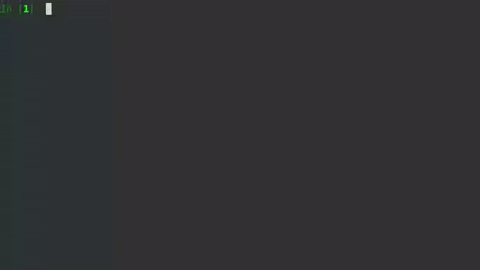


_<sub>NOTE: Printy manages the most common and simple tasks when it comes to print 
text and to validate some input. If you want to have more control over the 
console output check out **[Rich](https://github.com/willmcgugan/rich)** by @willmcgugan, 
an amazing library that let's you do much more cool things!!</sub>_

## Table of Contents

1. [Installation](#installation)
2. [How to use it?](#how-to-use-it)
    1. [Using global flags](#using-global-flags)
    2. [Using inline flags](#using-inline-flags)
3. [What about input()?](#what-about-input)
4. [Curious?](#curious)
5. [API](#api)
    1. [printy()](#printy)
    2. [inputy()](#inputy)
    3. [List 1: flags](#list-1-flags)
    4. [List 2: types](#list-2-types)
    5. [List 2: conditions](#list-3-conditions)
6. [Changelog](#changelog)
7. [Dependencies](#dependencies)
8. [Contributing](#contributing)
9. [Contributors](#contributors-)

## Installation

you can either clone this repository or install it via pip
```python
pip install printy
```

## How to use it?

Once you install printy, you can find a short but concise documentation about the
available flags and the syntax by running the following command on your console:
```python
python -m printy
```

This will print out some instructions right away.

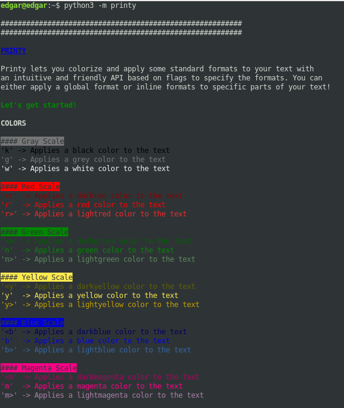
 
#### Using global flags

First of all, import printy:
```python
from printy import printy
```

Printy is still a 'print' statement, so you can use it as it is:
```python
printy("text with no format")
```

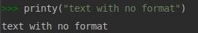

You can use a global set of flags to specify a format you want to apply to the text,
let's say we want to colorize a text with a bold blue and also adding an underline:
```python
printy("Text with a bold blue color and underlined", 'bBU')
```


#### Using inline flags
Although applying a global format is interesting, it is not as much as applying
some specific format to some section of the text only. For that, printy uses a 
intuitive syntax to accomplish that goal. Use the [] to specify the flags to use
for formatting the text, right before the text, and the @ to finish the formatting 
section:
```python
printy("Predefined format [rI]This is red and with italic style@ also predefined format")
```
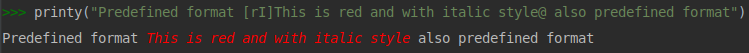

The text that is not surrounded by the format syntax will remain with the predefined 
format.

But you can always override this predefined format for inline format specifying the flags 
in the 'predefined' parameter
```python
printy("Now this is blue [rI]Still red italic@ and also blue", predefined="b")
```
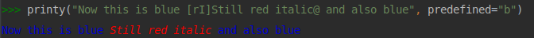

Or, you can override the whole format without changing the inline format with a global flag:
```python
printy("Now i am still blue, [rI]and also me@, and me as well ", "b")
```
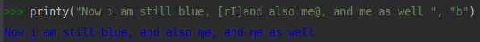

You can combine it with f-strings:
```python
a = 60
printy(f"The day has [yB]{ 24 * a }@ minutes")
```
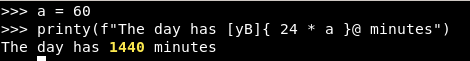

Printy also supports reading from a file, just pass the path to your file
in the file parameter:

```python
# NOTE: Here, it is necessary to specify the flags (if you want) 
# in the 'flags' parameter
printy(file="/path/to/your/file/file.extension", flags="cU")
```
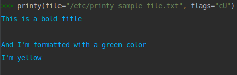


## What about input()?

Printy also includes an alternative function for the builtin input(), that, not only
lets us applies formats to the prompted message (if passed), but also, we can force
the user to enter a certain type of data.
```python
from printy import inputy
```
Let's say we want to get an integer from the user's input, for that, we can set
type='int' in the 'inputy' function (we can specify formats the same way we'd do
 with printy)
```python
fruits = ["Apple", "Orange", "Pineapple"]
fruit = inputy("Select a fruit: ", options=fruits, condition="i")

qty = inputy("How many [yBU]%ss@ do you want?" % fruit, predefined="rB", type="int", condition="+")

confirmation = inputy("Are you sure you want [r]%d@ %ss?" % (qty, fruit), type="bool", options=["y", "n"], condition="i")
```

In all of the above examples, if the user enters a value with a type other than 
the one specified in 'type' (default is 'str'), the message will show again and will prompt also a warning 
(and so on until the user enters a valid value according to the type)

You can pass certain conditions to validate the input, for example, you can 
pass ```condition="+"``` on an input with type 'int' to force the user to enter
a positive integer (valid also for 'float'), check the complete options below

**The best part** is that the returned value's type is also the one of the specified 
type, therefore, from the above examples, both *fruit* will be str, *qty* will be integer, and
*confirmation* will be a boolean, so, you're gonna get the information right as you need it.   

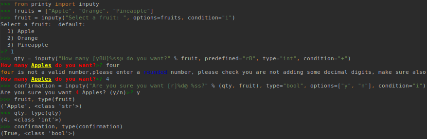


## Curious?

If you want to know what's behind the scenes, you can get the text with all the ANSI escaped sequences,
for that, use the ```raw_format()``` function.

```python
from printy import raw_format
raw_text = raw_format("Some [rB]formatted@ [yIU]text@")
print(repr(raw_text))  
print(raw_text)
```

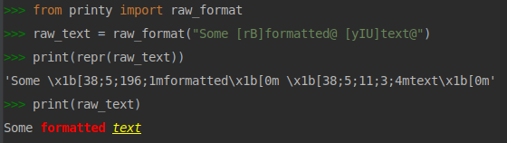

For convenience, we have stored all colors and formats flags in list, in case you need them:

```python
from printy import COLORS, FORMATS
print(COLORS)
print(FORMATS)
```

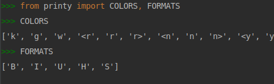

## API

### printy()

| Parameters | type |  | Description |
| --- | --- | --- | --- |
| value | str | required | Value to be formatted |
| flags | str | optional | Global flags to be applied, they can be passed in the 'value' with the following syntax: [flags]value@ (check [List 1](#list-1-flags) for more info)|
| predefined | str | optional | A set of flags to apply to the value as its predefined value |
| file | str | optional | A path to a file where we want to read the value from | 
| end | str | optional | A value to be appended to the value, default is '\n' |

### inputy()
<sub>plus printy() parameters</sub>

| Parameters | type |  | Description |
| --- | --- | --- | --- |
| type | str | optional | Type of value we want the user to enter (check [List 2](#list-2-types) for more info)|
| options | list | optional | Valid only for types 'str' and 'bool', a list of options to scope the value |
| render_options | bool | optional | Specify whether we want to display the options to the user or not | 
| default | str | optional | If no value is entered, this one will be taken, make sure that it belongs to the options list (if passed) | 
| condition | str | optional | A character that applies certain restrictions to the value (check [List 3](#list-3-conditions) for mor info |

### List 1 'flags'

**COLORS**
- k - Applies a black color to the text
- g - Applies a grey color to the text
- w - Applies a white color to the text
- <r - Applies a darkred color to the text
- r - Applies a red color to the text
- r> - Applies a lightred color to the text
- <n - Applies a darkgreen color to the text
- n - Applies a green color to the text
- n> - Applies a lightgreen color to the text
- <y - Applies a darkyellow color to the text
- y - Applies a yellow color to the text
- y> - Applies a lightyellow color to the text
- <b - Applies a darkblue color to the text
- b - Applies a blue color to the text
- b> - Applies a lightblue color to the text
- <m - Applies a darkmagenta color to the text
- m - Applies a magenta color to the text
- m> - Applies a lightmagenta color to the text
- <c - Applies a darkcyan color to the text
- c - Applies a cyan color to the text
- c> - Applies a lightcyan color to the text
- <o - Applies a darkorange color to the text
- o - Applies a orange color to the text
- o> - Applies a lightorange color to the text
- \<p - Applies a darkpurple color to the text
- p - Applies a purple color to the text
- p> - Applies a lightpurple color to the text

**FORMATS**
- B - Applies a bold font weight to the text
- U - Applies an underline to the text
- I - Applies an italic font type to the text
- H - Highlights the text
- S - crosses out the text, aka Strike

### List 2 'types'
- 'int': Value must be an integer or a string that can be turn into an integer, returns the value as an integer
- 'float': Value must be a float or a string that can be turn into a float, returns the value as a float
- 'bool': A string matching 'True' or 'False' if no options are passed, otherwise, a string that matches one of the options, returns the value as a boolean
- 'str': The default type, if 'options' is passed, then the string must match one of the options or its item number.

### List 3 'conditions'
- '+': Valid for 'int' and 'float' types only. The value must be a **positive** number
- '-': Valid for 'int' and 'float' types only. The value must be a **negative** number
- 'i': valid for 'str' and 'bool' types only. The value is case insensitive, by default it is case sensitive


## Changelog

[Changelog.md](CHANGELOG.md)

## Dependencies

Printy currently supports Python 3.5 and up. Printy is a cross-platform library

## Contributing

Please feel free to contact me if you want to be part of the project and contribute.
Fork or clone, push to your fork, make a pull request, let's make this a better app 
every day!!

## Contributors ✨

Thanks goes to these wonderful people ([emoji key](https://allcontributors.org/docs/en/emoji-key)):

<!-- ALL-CONTRIBUTORS-LIST:START - Do not remove or modify this section -->
<!-- prettier-ignore-start -->
<!-- markdownlint-disable -->
<table>
  <tr>
    <td align="center"><a href="https://github.com/edraobdu"><br /><sub><b>Edgardo Obregón</b></sub></a><br /><a href="https://github.com/edraobdu/printy/commits?author=edraobdu" title="Code">💻</a> <a href="https://github.com/edraobdu/printy/commits?author=edraobdu" title="Tests">⚠️</a> <a href="#example-edraobdu" title="Examples">💡</a> <a href="#ideas-edraobdu" title="Ideas, Planning, & Feedback">🤔</a> <a href="#maintenance-edraobdu" title="Maintenance">🚧</a> <a href="https://github.com/edraobdu/printy/commits?author=edraobdu" title="Documentation">📖</a> <a href="https://github.com/edraobdu/printy/issues?q=author%3Aedraobdu" title="Bug reports">🐛</a></td>    
    <td align="center"><a href="https://github.com/farahduk"><br /><sub><b>farahduk</b></sub></a><br /><a href="#ideas-farahduk" title="Ideas, Planning, & Feedback">🤔</a> <a href="https://github.com/edraobdu/printy/commits?author=farahduk" title="Code">💻</a> <a href="#maintenance-farahduk" title="Maintenance">🚧</a></td>
    <td align="center"><a href="https://github.com/mihirs16"><br /><sub><b>Mihir Singh</b></sub></a><br /><a href="https://github.com/edraobdu/printy/commits?author=mihirs16" title="Tests">⚠️</a> <a href="https://github.com/edraobdu/printy/commits?author=mihirs16" title="Code">💻</a></td>
    <td align="center"><a href="https://soundcloud.com/lalalaaalala"><br /><sub><b>musicprogram</b></sub></a><br /><a href="#userTesting-musicprogram" title="User Testing">📓</a></td>
  </tr>
</table>

<!-- markdownlint-enable -->
<!-- prettier-ignore-end -->
<!-- ALL-CONTRIBUTORS-LIST:END -->

This project follows the [all-contributors](https://github.com/all-contributors/all-contributors) specification. Contributions of any kind welcome!